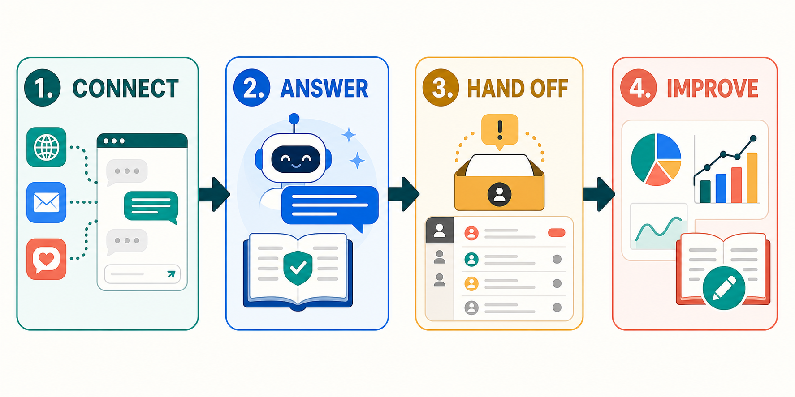

<div align="center">

<h1><span style="color:#0D9488">FrontDesk</span></h1>

<p><strong><span style="font-size:1.35em;color:#2563EB">Answer GitHub Issues and Discussions with approved knowledge. Hand off safely.</span></strong></p>

<p>
  
  
  
</p>

</div>

A GitHub support bot that turns new Issues, Issue comments, Discussions, and
Discussion comments into grounded answers and shared-inbox conversations. It
runs as a GitHub Action on hosted or self-hosted runners, or through a signed
GitHub webhook. Public authors remain read-only guests, and unsupported, billing,
security, or data-loss questions are handed to a person. Existing web, Slack,
Teams, Meta, WhatsApp, and email channels remain available.

**Start here:** [GitHub Issues and Discussions setup](docs/github-support.md).

**Choose a one-time FrontDesk plan:**

- [Solo — $299 USD](https://www.paypal.com/ncp/payment/D973WXW3HCZ9E), one location and self-setup;
- [Shop — $699 USD](https://www.paypal.com/ncp/payment/9SDPW2BCLUB44), one location with initial setup assistance;
- [Multi — $1,199 USD](https://www.paypal.com/ncp/payment/6EVAGLWEC77EL), up to five locations with connector setup assistance.

This is ShellieSoftwareTools' external product-sale page. PayPal is not embedded
in FrontDesk, and the delivered application does not create, capture or refund
payments.

**Seller:** ShellieSoftwareTools, operated by Hiroshi Aoki  
**US mailing address (CMRA):** 444 Alaska Avenue, Suite #CPT315,
Torrance, CA 90503, USA



<p align="center"><strong><a href="docs/ease-of-use.html">OPEN THE COLOR QUICK-START AND DAILY WORKFLOW PAGE</a></strong></p>

<p align="center"><strong><a href="docs/beauty.html">FRONTDESK FOR SALONS, BARBERS, NAILS, ESTHETICS & SPAS</a></strong></p>

Built for the US and UK markets. The customer web chat and ecommerce replies support
English and US Spanish; the additional industry packs are English. One setting picks
the market, and it decides currency, date format, and the number a healthcare persona
tells somebody to call in an emergency.


---

## <span style="color:#0D9488">GitHub support setup</span>

Add the included `action.yml` to a tagged GitHub repository and use the workflow
in [the GitHub support guide](docs/github-support.md). Grant only `contents: read`,
`issues: write`, and `discussions: write`. GitHub Actions supplies the short-lived
`GITHUB_TOKEN`; the selected AI provider key stays in Actions secrets.

The same bot can run behind `POST /github` for a GitHub App or repository webhook.
Signed delivery verification, durable redelivery deduplication, bot-loop rejection,
per-installation tenant isolation, REST Issue replies, and GraphQL Discussion
replies are included.

## <span style="color:#0D9488">Other deployment modes</span>

### Cross-platform edition — Windows, macOS and Linux

FrontDesk 1.6 is delivered first as a browser application in an OCI container.
The customer chat and shared inbox work from a PC, tablet, iPhone or Android
browser, while the same server package runs on Windows, macOS and Linux. The
safe default stays on the current computer; a production deployment uses a
trusted HTTPS reverse proxy.

```bash
docker compose up -d --build
```

The base composition starts the no-AI Echo demonstration. The optional Ollama
composition runs the local model in a separate container, so customers do not
install Python or Ollama on the host:

```bash
docker compose -f compose.yaml -f compose.ollama.yaml up -d --build
```

Secrets must be generated before the first start. Follow the complete
[cross-platform installation and security guide](docs/cross-platform.md).

### Windows portable edition — compatibility option

Extract the Windows ZIP and double-click **`FrontDesk.exe`**. Python 3.11+
and the local `llama.cpp` AI runtime are already included. Answer three short
questions:

1. United States or United Kingdom;
2. English or US Spanish;
3. real local AI or the safe Echo demonstration.

The first real-AI launch asks permission to download the official 5.03GB
Qwen3-8B Q4_K_M model. FrontDesk pins its exact revision and verifies SHA-256
before installing it. The model and operational data remain under
`%LOCALAPPDATA%\ShellieSoftwareTools\FrontDesk`; application updates do not
erase conversations, the inbox, webhook deduplication, or knowledge files.

FrontDesk then creates temporary authentication, selects the salon workflow,
starts customer chat and the shared inbox, opens both pages, and copies the
administrator token for you. It does not save the token or signing secret to a
file. Press `Ctrl+C` in the launcher window to stop both services.

The source/developer edition also remains available on Windows, macOS and Linux:

```bash
python quickstart.py --guided
```

For a one-command US English salon launch with Ollama:

```bash
python quickstart.py
```

For the source edition, Ollama must be running with `qwen3:8b`. If it is not ready, the launcher stops
and prints the exact preparation command. A no-AI demonstration remains
available with `python quickstart.py --provider echo`.

### Advanced manual setup

With Python 3.11 or newer, it runs with no model credentials at all. Every
session is authenticated, including this one, so start by issuing yourself a
token — three commands, and the same three you would run in production.

For a production-identical dependency set, install `requirements.lock.txt`.
`requirements.txt` keeps the supported ranges for development and evaluation.

```bash
python auth.py --new-secret
```

```bash
export FRONTDESK_AUTH_SECRET=<the secret it printed>
```

```bash
export FRONTDESK_ACCESS_TOKEN=$(python auth.py --subject you@example.com --roles operator)
```

On Windows `cmd` use `set NAME=value`; in PowerShell, `$env:NAME = "value"`.
Then:

```bash
python chat.py --provider echo
```

`echo` is a dry-run provider that calls no API. Use it to see how the screen
looks, when tools get called, and what the confirmation dialog does.

**To get real answers locally**, start Ollama and use the bundled default model.

```bash
ollama pull qwen3:8b
python chat.py --provider ollama --persona ecommerce
```

`auto` also selects Ollama. A cloud credential left in the environment never
silently changes where a customer's conversation is sent. To use a cloud model,
select it explicitly:

```bash
pip install anthropic
set ANTHROPIC_API_KEY=sk-ant-...
python chat.py --provider anthropic --persona ecommerce
```

## When something does not work

```bash
python chat.py --doctor
```

It reports authentication, model, the knowledge index, the backend and
the audit log on one screen, and for anything missing it prints **the command
that fixes it**. Run this first. It exits 1 when something needs action, so it
also works as a pre-flight check in CI.

LinkedIn OpenID Connect is an optional step-up identity provider. Public knowledge
chat starts without it; account-specific tools remain permission-gated. This is
identity verification, not an inbound LinkedIn DM connector.

## What it does

```
You> Where is order A-88003?
  [tool] get_order_status({"order_id": "A-88003"})
  [result] {"order_id": "A-88003", "status": "Delivered", "amount": 189.5, ...}

Bot> Order A-88003 was delivered. If that does not match what you received,
     I can create a handoff for a teammate.
```

- **Seventeen industry personas** — ecommerce, salons, hospitality, property,
  automotive, education, home services, events, finance, healthcare, legal,
  recruiting, SaaS, internal help desk and more, each with explicit safety and
  regulated-work boundaries
- **US and UK** — `--region uk` switches currency, dates, spelling, the regulator
  named, and 911 to 999. 05/09/2026 means two different days; the agent is told which
- **Provider independent** — Claude, OpenAI or a local model, switched by one setting
- **A confirmation gate** — anything hard to undo is approved one action at a
  time, and without approval nothing runs
- **No payment processing** — FrontDesk has no tools that create, capture or
  refund payments; billing stays in systems controlled by the purchaser
- **Answers with sources** — approved documents are searched and cited, entirely
  locally; nothing is sent anywhere
- **A tamper-evident audit log** — hash chained, and the chain holds across rotation
- **Slack, Teams, Meta, WhatsApp and email** — signed webhooks for platform and
  relay traffic, plus a purchaser-controlled IMAP/SMTP mailbox option. Retries
  are durably deduplicated, automatic email loops are blocked, and failed email
  replies remain available for the next poll
- **Approvals on a phone** — when a reservation change is asked for at 9pm and nobody is at a
  desk, the action waits on the owner's phone instead of being declined. Silence
  is still a no
- **A real human handoff** — unresolved work becomes a persistent ticket with a
  reference ID. An administrator can review and resolve it from the local admin
  dashboard, and the queue survives a restart
- **Step-up identity** — public knowledge works as a guest; a deployment may
  configure LinkedIn OpenID Connect before exposing account-specific tools
- **Accessible customer web chat** — responsive English and US Spanish UI with
  keyboard operation, live-region announcements, strict CSP, CSRF protection,
  GPC acknowledgement and no third-party assets
- **Durable by default** — SQLite keeps conversations, webhook deduplication,
  tenant business data and privacy requests across restarts
- **Bounded third-party resilience** — safe reads and idempotency-keyed writes
  retry `429` and transient failures with backoff and jitter; repeated provider
  failures open a circuit instead of exhausting workers. See
  [External API performance](docs/external-api-performance.md)
- **Tenant boundaries end to end** — channel identities, sessions, knowledge
  indexes, demo records and REST connector requests all carry a tenant id
- **PDF and Office knowledge** — local hybrid retrieval ingests PDF, DOCX, PPTX,
  XLSX, Markdown, text and HTML without sending documents to an embedding service
- **Daily support workspace** — persistent shared inbox, assignment, takeover,
  internal notes, CSAT analytics, and tenant-scoped knowledge upload
- **Cross-channel CSAT** — expiring signed rating links provide accessible English
  and US-Spanish feedback pages for email and other non-widget conversations
- **Business integrations** — Shopify, Zendesk, and HubSpot profiles reference
  secrets by environment-variable name and use purchaser-owned credentials

## Customer web chat

```bash
python webchat.py --port 8766
```

Open `http://127.0.0.1:8766/`. Use `?lang=es` for US Spanish. Production must
place the server behind HTTPS. Anonymous visitors remain guests; an account page
may send a signed Frontdesk bearer token for authenticated access.

Select an installed industry pack with `FRONTDESK_WEB_PERSONA`; an invalid name
falls back to `ecommerce` or `ecommerce-es` instead of preventing startup.

Embed the floating widget after setting `FRONTDESK_PUBLIC_ORIGIN` and allowed
`FRONTDESK_EMBED_ORIGINS`:

```html
<script src="https://support.example.com/embed.js" data-lang="en" defer></script>
```

## Quality and recovery checks

```bash
python -m unittest discover -s tests -v
python load_test.py --requests 100 --concurrency 20
python disaster_recovery.py data/recovery-test.db
python evaluate.py --provider openai
python accessibility_check.py --url http://127.0.0.1:8766/
```

Operational acceptance procedures are in
[`docs/accessibility-user-test-protocol.md`](docs/accessibility-user-test-protocol.md),
[`docs/recovery-exercise-runbook.md`](docs/recovery-exercise-runbook.md), and
[`docs/secret-rotation-runbook.md`](docs/secret-rotation-runbook.md). Signed
distribution and rollback are covered by
[`docs/release-signing.md`](docs/release-signing.md).

Real model evaluation requires a configured provider. Live channel checks
use `python verify_channels_live.py`. Compliance readiness evidence is documented
in [docs/compliance-readiness.md](docs/compliance-readiness.md); it is not a legal
certification.

## Where to go next

| If you want to | Read |
| --- | --- |
| Deploy it, connect Slack/Meta, wire up real systems, load knowledge | [docs/customer-guide.md](docs/customer-guide.md) |
| Follow the visual setup and daily shared-inbox workflow | [docs/ease-of-use.html](docs/ease-of-use.html) |
| Review 15 clearly fictional customer workflow examples | [docs/illustrative-use-cases.md](docs/illustrative-use-cases.md) |
| Prepare compliant US/UK business outreach | [docs/marketing-outreach.md](docs/marketing-outreach.md) |
| Prepare truthful X and Instagram creative | [docs/social-campaign.md](docs/social-campaign.md) |
| Look up an option, tool, role or environment variable | [docs/reference.md](docs/reference.md) |
| Read the product description written for customers | [docs/product-en.md](docs/product-en.md) |
| Configure the salon and wellness industry pack | [docs/salon-setup.md](docs/salon-setup.md) |
| See why it is built this way | [docs/design-notes.md](docs/design-notes.md) |
| Separate Shellie, customer, PayPal and social-network data responsibilities | [docs/data-responsibility.md](docs/data-responsibility.md) |
| Review the current legal-risk register and escalation triggers | [docs/legal-risk-register.md](docs/legal-risk-register.md) |
| Review the customer legal-pack drafts | [docs/legal/README.md](docs/legal/README.md) |

## Layout

```
chat.py            the conversation loop, tool execution, the confirmation gate
providers.py       provider abstraction and history-to-wire translation
tools.py           tool definitions and the demo backend
webhooks.py        the receiver Slack, Teams and Meta post to
mobile.py          the approval screen, for a phone
approvals.py       actions parked, waiting for a person
handoffs.py        persistent human-handoff queue
linkedin_verify.py the LinkedIn sign-in callback
connectors.py      the REST layer that reaches real systems
auth.py            token issuance and role permissions
audit.py           the tamper-evident audit log
rag.py             local document search
state.py           durable tenant-scoped SQLite state
webchat.py         accessible English and Spanish customer web chat
email_mailbox.py   purchaser-controlled IMAP intake and SMTP replies
feedback.py        expiring signed cross-channel CSAT links
privacy.py         privacy-rights request, export and approved deletion workflow
evaluate.py        real-LLM golden quality evaluation
admin.py           the localhost admin screen
doctor.py          configuration diagnosis
i18n.py            everything the product says out loud
regions.py         what differs between the US and the UK
config.py          configuration and .env loading
personas/          seventeen industry personas plus the default
knowledge/         documents to put in the knowledge base
tests/             tests
docs/              documentation, images, interactive demo
```

## A warning

`--auto-approve` skips confirmation. It exists for testing. **Do not use it in
production.** The same goes for `FRONTDESK_AUTH_MODE=disabled`.

## Licence

Apache License 2.0. See [LICENSE](LICENSE) and [NOTICE](NOTICE).
An external product purchase does not replace or restrict the rights granted by
that licence.
