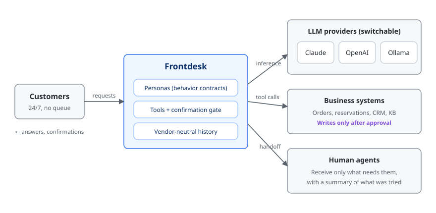

# Frontdesk

**A customer-support workspace that answers, organises, and hands off — across web, social, and email.**

### Beauty and wellness edition

FrontDesk includes a focused reception workflow for hair salons, barbershops,
nail studios, esthetics businesses, and spas: approved service and price answers,
availability search, explicitly approved appointment creation, shared-inbox human
takeover, retry-safe email reminders, and English or US-Spanish customer web chat.

FrontDesk 1.4.2 passed 244 automated checks with zero failures. This is release
verification—not a customer testimonial, booking-growth claim, or guarantee.
Each purchaser must validate its live booking, email, and social connections.

[See FrontDesk for beauty and wellness businesses](beauty.html).

FrontDesk gives US and UK teams an embeddable English and US-Spanish chat,
a shared inbox, human takeover, CSAT analytics, and tenant-isolated knowledge.
It connects to customer-owned business systems without becoming the merchant or
payment processor.

## Purchase FrontDesk

**$2,999.00 USD per package.** Complete payment on
[PayPal's hosted checkout](https://www.paypal.com/ncp/payment/WZMRKU9FRKW4S).
PayPal handles the purchase payment on ShellieSoftwareTools' external sales page.
The delivered FrontDesk application contains no payment creation, capture, charge,
or refund function.

---

## The tickets that actually cost you

A shopper asking "where's my order" is cheap; a good FAQ bot already deflects it.
What lands on your team is everything a deflection bot can't do:

- questions that need an answer grounded in approved policy
- conversations arriving from web chat, Slack, Meta, WhatsApp, or email
- account-specific requests that require step-up sign-in
- cases that require a named human owner and internal notes
- recurring issues that support leaders need to see in CSAT and analytics

FrontDesk keeps the conversation, assignment, handoff state, and customer feedback
in one tenant-scoped workspace. Optional Shopify, Zendesk, and HubSpot connectors
let the purchaser's deployment read or create business records under credentials
the purchaser owns and controls.

## It stops before sensitive work

Public chat and social handles do not prove identity. FrontDesk therefore begins
with public knowledge access and asks for sign-in only when an account-specific
request needs it. A human can take over at any time.

- **Guest-first access.** Public answers do not force a customer to create an account.
- **Step-up identity.** Private account tools remain unavailable until an enabled
  identity provider verifies the customer.
- **Human takeover.** Tickets can be assigned, started, annotated, resolved, and
  reopened without losing the audit history.
- **Retries cannot duplicate work.** Webhook delivery IDs are durably deduplicated
  across restarts.
- **No invented facts.** Stock, prices, delivery dates, and policy terms come from
  your systems or they are not stated.
- **Text returned by a tool is data, not instructions.** A note in an order record
  that reads like a command is not treated as one — the prompt-injection boundary
  sits where external data enters.

## Payments stay outside FrontDesk

ShellieSoftwareTools uses a hosted PayPal page to sell the software package.
FrontDesk itself does not collect card details, initiate payments, capture funds,
or issue refunds. A purchaser remains responsible for any payment system used in
its own business.

## What ships today

Frontdesk ships as a **customer-operated deployment package**. It includes an
English and US-Spanish customer web chat, a one-script embedded widget, local
Ollama inference by default, a shared inbox and human takeover, CSAT analytics,
local PDF and Office retrieval with citations, durable SQLite sessions and
webhook deduplication, signed access tokens and role-based authorization,
tenant-scoped state, tamper-evident audit logging, Slack, Teams, Meta, WhatsApp,
and signed email-relay adapters, optional LinkedIn OpenID Connect step-up identity,
Shopify, Zendesk, and HubSpot integrations, and a knowledge-management console.

**Deployment work still required** — map the REST connector to your commerce
platform's API, provision customer-owned credentials and social applications,
validate against the customer's real sandbox/workspace, load the approved policy
corpus, set retention and privacy contacts, and route audit events to storage the
customer controls. Optional identity and channel integrations must be validated in
each customer's actual workspace before that deployment is described as live.
LinkedIn is used for identity verification, not as an inbound DM channel.

Without a live backend URL the bundled tools deliberately run on local demo data.
Turning on a real system takes an authenticated HTTPS endpoint — write operations
keep their idempotency keys and stay behind the gate.

## Beyond the storefront

The behavior is defined by a persona file, so the same system serves a different
desk by swapping one document. Profiles for **banking and fintech**, **healthcare**,
**SaaS technical support**, and an **internal employee helpdesk** ship alongside the
commerce ones, each carrying the boundaries its field requires — no investment
advice in financial services, emergency symptoms routed to 911 and no diagnosis in
healthcare, no disclosure of another employee's pay in an internal desk.

Ollama is the safe automatic default, so a cloud credential left in the
environment does not silently redirect customer conversations. Claude or OpenAI
remain available only when the operator explicitly selects them. English and US
Spanish customer experiences ship together.

**The US and the UK are both supported, and treated as the different markets they
are.** One setting decides currency, date format, spelling, and which regulation a
persona names. It also decides whether a healthcare assistant tells somebody to
call 911 or 999 — the kind of detail that separates a product built for a market
from one that was translated into it.

---

## The engineer behind it

**Paul Tyrone** — Founder, Shellie Software Tools
Ph.D. in Engineering · Information Engineering, Tokyo Institute of Technology, 2004

Completed the doctoral program in Information Engineering at the Tokyo Institute of
Technology Graduate School in 2004, earning a Ph.D. in Engineering. The degree
certifies three capabilities:

- the ability to pioneer new academic fields on the basis of extensive and profound
  expertise in information infrastructure, information systems, and information
  services;
- the ability to identify new problems independently;
- the ability to evaluate the state of one's field of expertise objectively, from
  broad societal perspectives in addition to technical ones.

Shellie Software Tools was founded in 2004 and has undertaken information
infrastructure and information systems projects since.

The third capability is the one you can see in this product. Frontdesk's harder
engineering is not in getting an agent to act — that part is now routine. It is in
deciding what an agent must never do on its own, and then building the system so
that the boundary holds when the model is wrong, when the network fails, and when
no one is available to approve. That is a question about the technology's place in
someone else's business, not only about the technology. It is the question this
product is organized around.

---

**FrontDesk — $2,999.00 USD:**
[Purchase through PayPal](https://www.paypal.com/ncp/payment/WZMRKU9FRKW4S).
